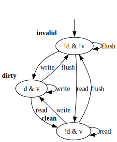
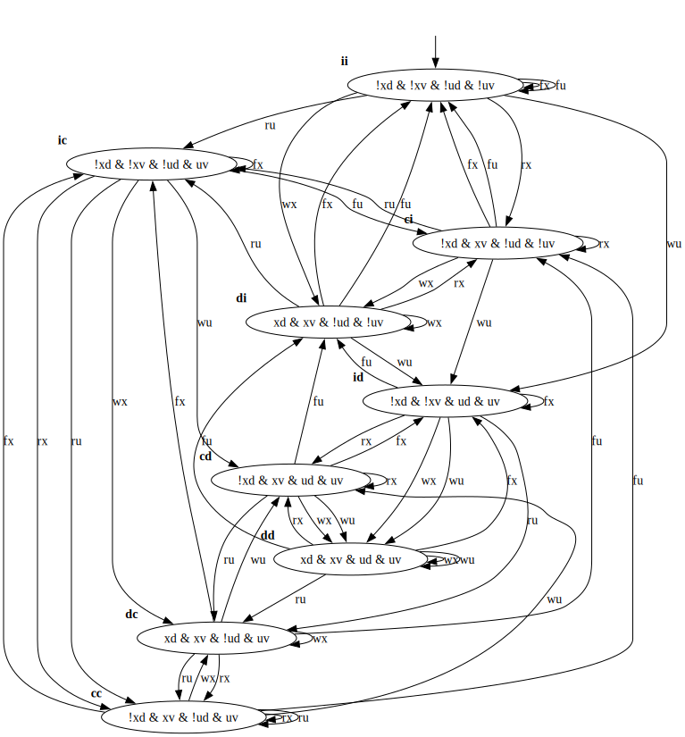
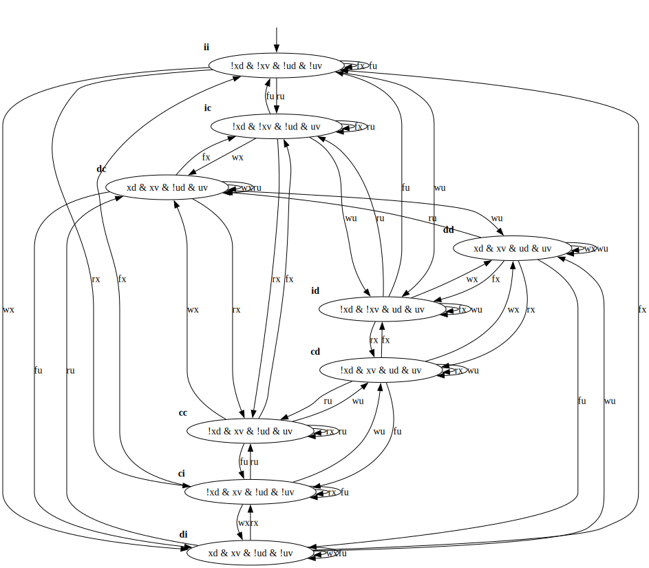

This model describes a register file cache.

# `xreg`

This is a genral purpose register.

# The register can be:
* `invalid`
* `dirty`
* `clean`

# The following set of operations is defined:
* `write`
* `read`
* `flush`

# Kripke Structure for `xreg` register:
Atomic propositions: `d`, `v`.

# `xreg` and `ureg`

`ureg` is a second register in the model.

# LTS multiplication for `xreg` and `ureg` register:
Atomic propositions: `xd`, `xv`, `ud`, `uv`.

# Constraints:
* Any access to `ureg` makes `xreg` dirty (Meaning: accessing `ureg` clobbers `xreg`).

# Kripke Structure for `xreg` and `ureg` registers:

